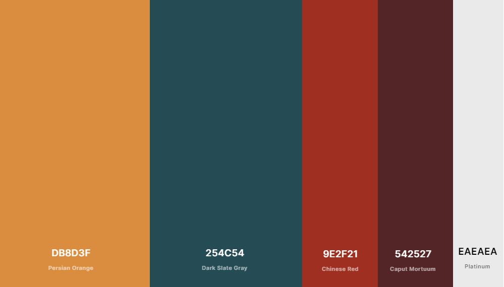

# [Magic Island](https://henriqueperoni.github.io/CI-MS2-Magic-Island/)

#ADD MOCKUP
The aim of this project is to show all the beauty a tourist will find if traveling to Mallorca. I kept the project simple providing information about beaches, places to eat, and things to do. But it can be upgraded easily, and also would feasible have partners and section to book rooms, cars, etc..

## Table of Contents:

- [User Experience](#user-experience)

  - [Strategy](#1-strategy)
  - [Scope](#2-scope)
  - [Structure](#3-structure)
  - [Skeleton](#4-skeleton)
  - [Surface](#5-surface)

- [Features](#features)

  - [Existing Features](#existing-features)
  - [Features to consider implementing in the future](#features-to-consider-implementing-in-the-future)

- [Technologies Used](#technologies-used)

  - [Languages](#1-languages)
  - [Integrations](#2-integrations)
  - [Workspace, Version Control, and Repository Storage](#3-workspace-version-control-and-repository-storage)

- [Resources](#resources)

- [Testing](#testing)

- [Deployment](#deployment)

- [Credits](#credits)

  - [Content](#content)
  - [Media](#media)
  - [Code](#code)

- [Acknowledgments](#acknowledgments)

## User Experience

### 1. Strategy

Project Goals:

- Provide information on holiday destinations.

- Inspire people that are thinking to go on holiday with images and tips.

- Increase the number of tourists in Mallorca.

Customer Goals:

- Get inspired for their next holiday destination.

- Find accurate information on different subjects

- Have a way to make contact and clarify doubts.

### 2. Scope

The Magic Island website is contained within a single webpage. Users do not have to navigate away to use all the elements included in the website. Elements of the homepage are interactive including buttons that show all the things that are possible to do in Mallorca. The website also has a Google Maps API to provide direction.
There is also some JavaScript and GSAP animations to make the experience more user friendly.

### 3. Structure

The main focus of the structure is to allow users to quickly understand what the website is about. With a navigation bar that represents a sunset, a hero image of a beach, and a small description on the main page is easy for a user to understand the site proposal.
Users are invited to scroll down through a button and the next is nicely fade in in the screen with some general information and after some more specific information.
To finish the website the user can send a message through a form in the case have any doubt.

### 4. Skeleton

# ADD WIREFRAME

- Wireframes

- Fixed navigation bar(Burguer menu for small screens)

- Home, About, Things to Do, and Contact pages

- Footer with social media icons

### 5. Surface

**Colors**:

Following the 60%/30%/10% rule, I decided to have two main colors which represent 60% of the website, as the website is about an island the two colors represent the sun(#db8d3f ) and the sea(#254c54 ). Also, 2 colors, representing 30%, and one color for the last 10%. To keep the colors in harmony with the images I picked the colors from some parts of the images. The #254c54 was taken from the ocean of the hero image, #db8d3f from the village walls in the about section, and #9e2f21 from a food image.

**Typography**:

- "Josefin Sans" font (with fall-back font of Sans-Serif) for main hadings and navigation bar.

- "Montserrat" font (with fall-back font of Sans-Serif) for general text. A classic font, which gives elegancy to the website and at the same time it's not too formal.

**Images**:
As mentioned in the colors section, the images, and colors and were carefully chosen to have good harmony between them.

## Features

### Existing Features

- Designed with HTML5, CSS3, JavaScript and GSAP.

- Animation before load website showing what to expect.

- About and Thing to Do sections nicely fade in with scroll.

- Things to Do section with buttons showing different things to do, and also showing the locations on the Google Maps API.

- Pop up Modal when submitting the form with thank you message.

- Scroll to top button - this feature enables the user to quickly move back to the top of the page. The button only shows up after the first scroll.

- Footer animation representing a sunset.

- Footer with social media links.

### Features to consider implementing in the future

- A partner section with a direct way to book rooms, cars.

- Sign in for a newsletter with the possibility to get discount vouchers in restaurants and attractions.

## Technologies Used

### 1. Languages

- [HTML5](https://en.wikipedia.org/wiki/HTML5)

- [CSS](https://en.wikipedia.org/wiki/CSS)

- [JavaScript](https://en.wikipedia.org/wiki/JavaScript)

### 2. Integrations

- [Google Fonts](https://fonts.google.com/) - Typography.

- [FontAwesome](https://fontawesome.com/) - Used for icons.

- [GSAP](https://greensock.com/gsap/) - Animations Library.

- [Google Maps JavaScript API](https://cloud.google.com/maps-platform/) - Interative Maps API.

- [EmailJS API](https://www.emailjs.com/) - Send Emails directly with JavaScript.

- [jQuery](https://jquery.com/) - JavaScript library.

### 3. Workspace, version control, and repository storage

- [Gitpod](https://www.gitpod.io/) - IDE (Integrated Development Environment) used to write the code.

- [GitHub](https://github.com/) - Repository hosting service to host the deployed website and track previous versions of code.

- [Git](https://git-scm.com/) - Version control tool to record changes and updates to my files.

## Resources

[W3.CSS](https://www.w3schools.com/w3css/defaulT.asp) - General resource.

[Stack Overflow](https://pt.stackoverflow.com/) - General resource.

[Youtube](https://www.youtube.com/) - General resource.

[CSS Matic](https://www.cssmatic.com) - Box Shadow Genetator.

[CSS Gradient](https://cssgradient.io/) - Gradient Generator

[CommonMark](https://commonmark.org/) - For Markdown language reference.

[Coolors](https://coolors.co/) - Find matching color palette for site.

[TinyPNG](https://tinypng.com/) - Efficient compression of images for site.

[Balsamiq](https://balsamiq.com/wireframes/) - Wireframing design tool.

[Unicorn Revealer](https://chrome.google.com/webstore/detail/unicorn-revealer/lmlkphhdlngaicolpmaakfmhplagoaln?hl=en-GB) - Google Chrome Extesion Overflow Revealer.

Code Institute SLACK Community - General Resource

## Testing

### HTML

- Ran HTML code through [HTML Validator](https://validator.w3.org/).

  - Two warnings for "The type attribute is unnecessary for JavaScript resources". Deleted both after check they really were not necessary.

  - Warning for about section lacks heading. As this section only contains an image and a short paragraph, a heading is not necessary.

  - Received an error because I had a-tag as a descendant of the button element. Styled the a-tag as a button and deleted and button element.

### CSS

- Ran HTML code through[HTML Validator](https://jigsaw.w3.org/css-validator/).
  - No errors found.

### JAVASCRIPT

- Intro Animation

  - Checked transitions(duration and delay) of images to the desired one.

- Navigation Bar and Scroll to Top button

  - Clicked on all navbar links and scroll to top button to ensure the smooth scrolling was working properly.
  - Tested links on small screens for the hamburger menu, and if it closes when clicked on one of the menu items.
  - Checked if the scroll to top button only shows up after the first scroll.

- About section
  - Checked if the text nicely fades into the screen when scroll reaches the center of the section as desired.
- Things to Do section

  - Checked if the place option buttons nicely fade in one by one.
  - Checked if the container info and the map nicely fade in at the same time from the bottom and the right, respectively.
  - Clicked all the button places to check if the choices buttons fade in.
  - Clicked all the choices buttons to check if the info container is changed to the desired one. Also if the Google Maps API goes to the right location.
  - Clicked all the markers on the Google Maps API to check if the info windows pop up. Also, clicked outside of the info windows to check if it closes.

- Contact section
  - Checked if modal pops up after the form been submitted.
  - Checked if the form resets after been submitted.
  - Checked if the message has been sent to the email desired.

### RESPONSINESS

- Check website at [Responsitor](https://www.responsinator.com/) - Shows the website in different devices.
- DevTools - Tested across a range of different devices. With different sizes.
- Viewed website in various browsers: Google Chrome, Firefox, Opera, Microsoft Edge.
- Wiewed of different physical devices: Iphone 8(375px), Iphone 11(414px), Xiaomi Redmi 9(393px), medium laptop(1280px), large desktop screen(1920px).

## Project barriers and solutions

- Had an issue with the images of the intro animation for medium and small screens. As the images were vertically positioned on large screens it was not fitting on small screens. I tried to use transform: rotate() property but it did not work for all images. I decided to edit the images in an editor and use the edit images with a media query for small and medium screens.

- After create the burger navigation bar for medium and small screens I had a big challenge trying to figure out how to close it by clicking on any of the nav items. After sharing this issue in the Code Institute Slack Comunity I was advised to use a for loop, and then I figure out a way to apply it.

-

* Unsolved issue: I wanted to add a smooth behavior when the markers of the map are changed. I tried to find a solution in the Google Maps API documentation, but could not find something to fix it. The map works perfectly, it would be just a better user experience.

## Deployment

This project has been deployed on GitHub Pages with the following process:

1. All code was written on Gitpod, an online IDE.

2. The code was then pushed to GitHub where it is stored in my Repository.

3. Under the settings section of the GitHub repository, scroll down to the GitHub Pages section.

4. Under 'Source' drop-down, the 'Master branch' was selected.

5. Once selected, this publishes the project to GitHub Pages and displays the site URL.

6. There is no difference between the deployed version and the development version.

7. The code can be run locally through clone or download.

8. You can do this by opening the repository, clicking on the green 'Code' button, and selecting either 'clone or download'.

9. The Clone option provides a URL, which you can use on your desktop IDE.

10. The Download ZIP option provides a link to download a ZIP file that can be unzipped on your local machine.

## Credits

### Media

- Most of the images were from [Unsplash](https://unsplash.com/), but also some was taken from [Pinterest](https://www.pinterest.ie/)

### Code

## Acknowledgments
